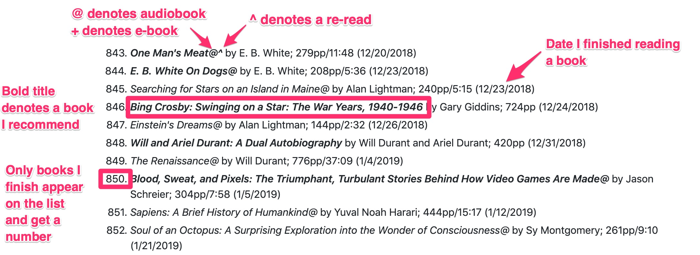
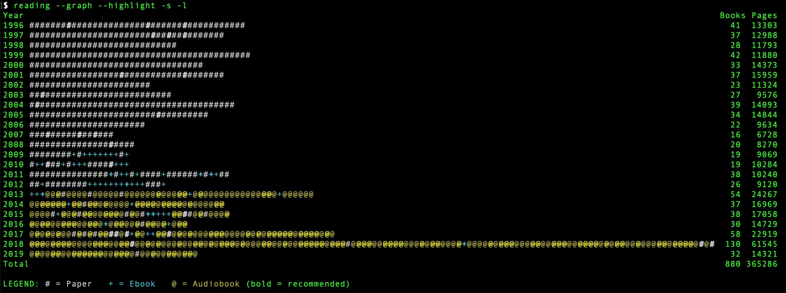

# What I have read since 1996

* **[My reading list since 1996](https://github.com/jamietr1/reading-list/blob/master/reading.md)**

## How to interpret the list

## Other lists I maintain

* [Modern Library 100 Best Nonfiction Books](https://github.com/jamietr1/reading-list/blob/master/modern-library-100-nonfiction.md)
* [Modern Library 100 Best Novels](https://github.com/jamietr1/reading-list/blob/master/modern-library-100-novels.md)
* [Sports Illustrated Top 100 Sports Books of All Time](https://github.com/jamietr1/reading-list/blob/master/sports-illustrated-top-100.md)

## Origin Story

I can't be certain, but I believe I started my list because I discovered [a list by Eric W. Leuliette](http://www.whatihaveread.net/) online sometime in late 1995. His list goes back to 1974 and that impressed me. Given that I read a lot, it seemed to me I should keep a list, too, and I began my list in January 1996 while visiting my grandfather in New York.

Over the years, the list has taken many forms. It stared as a spreadsheet, and then morphed into an HTML file I maintained manually so that it was accessible online. Over time it moved into a SQL database served up by perl and php scripts. Eventually it evolved into the simple plain text file it is today, the easiest of all forms for me to maintain. I keep the file on Github and use git's commit capabilities to manage changes to the list.

## Rules of the Road

1. Only books I finish go on the list. I don't track books I don't finish. Too much work.
2. Each finished book gets a number.
3. If I re-read a book, and finish it again, it goes on the list again with another number, but I also indicate it is a re-read with a ^ after the title.
4. Paper, e-books, and audiobooks all count, so long as I finish them.

## By the Numbers

I used to be obsessed with reading stats, to the point where my older lists from the mid-late-1990s had estimated word counts. Today, I am satisfied by some simple stats that I derive from my plain text list using a Python scripts I wrote (aptly called "reading").

In its simplest form, I can get a total count of books and pages read. More often, however, I like to look at breakdowns by year using simple charts, like this one showing everything I've read since 1996:

